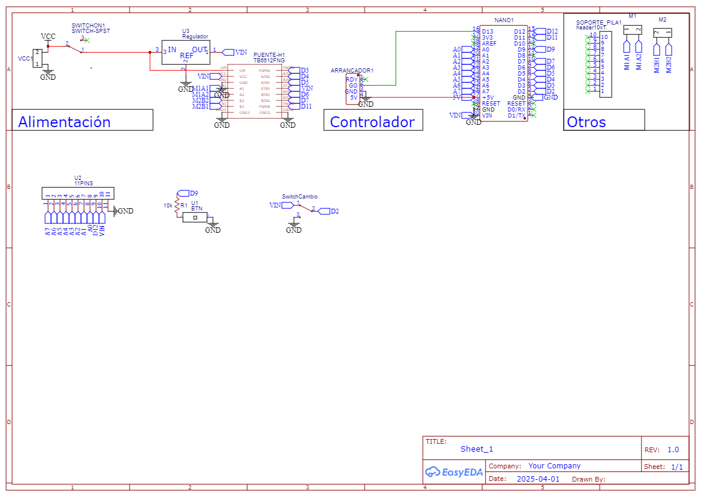
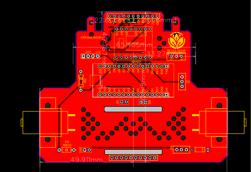
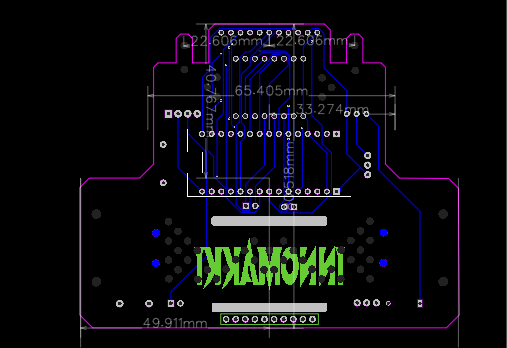

# Amateur Line Follower Robot

Welcome to the repository for the Amateur Line Follower Robot. This project is a classic, reliable build designed around standard maker components. It includes everything you need to manufacture the board and get the robot running on the track.

Unlike the previous projects, this one actually has the code ready to go. You have the hardware design files, the production files, and two different firmware flavors depending on how much you want to tinker with PID tuning.

---

## What’s in here?

The repository is structured to separate the firmware from the hardware design files:

* **`/basicLineFollower`** ── The plug-and-play firmware.
* **`/lfv2`** ── The advanced firmware with dynamic variable tuning.
* **`LinefollowerAmateur.json`** ── The main schematic file for EasyEDA.
* **`PCB_LinefollowerAmateur.json`** ── The PCB layout file.
* **Gerber Files** ── Ready-to-manufacture files are included in the project, so you can skip the CAD software entirely and just order the boards.

### Previews

#### Schematic Circuit

#### PCB Layers (Upper & Lower)
| Upper Layer | Lower Layer |
| :---: | :---: |
|  |  |

---

## Hardware Architecture

This build relies on standard, easily accessible components:

### 1. The Controller (Arduino Nano)
The brain of the operation. It reads the QTR sensor array, calculates the PID error, and sends the PWM signals to the motor driver. Simple, effective, and easy to replace if you fry it.

### 2. Motor Driver (TB6612FNG)
We are using the TB6612FNG instead of older, less efficient drivers. It handles the current for the motors perfectly without overheating and takes up very little space on the PCB.

### 3. Actuators (5V Yellow TT Motors)
The classic standard for amateur robotics. They are cheap, geared for decent torque and speed, and connect directly to the H-bridge outputs. 

---

## The Code (Firmware Versions)

You have two options for the brains of the robot, located in their respective folders:

### Option 1: `basicLineFollower`
This is the lightweight, hardcoded version. There is no EEPROM saving and no serial configuration. The PID constants (Kp, Ki, Kd) and speed settings are defined directly in the code as static variables. If you want to change how the robot behaves, you edit the code and flash the Arduino again. Perfect for a stable, final setup.

### Option 2: `lfv2`
This is the tuning version. It includes EEPROM memory management and a serial communication interface. You can send commands via the serial monitor to update Kp, Ki, Kd, and max speed on the fly without recompiling the code. Once you find the sweet spot, the values are saved to the Nano's EEPROM so the robot remembers them after a reboot.

---

## How to use the Hardware Files

If you want to modify the board:
1. Go to [EasyEDA](https://easyeda.com/).
2. Open a project workspace.
3. Import `LinefollowerAmateur.json` and `PCB_LinefollowerAmateur.json`.
4. Make your changes and export new Gerbers.

If you just want to build it:
Grab the Gerber files included in the repository, upload them to JLCPCB, PCBWay, or your manufacturer of choice, and order your boards.